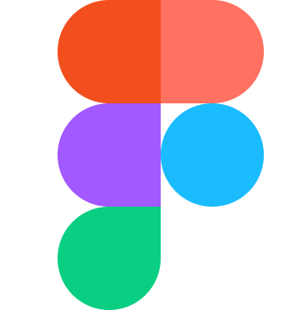

    

     

<!-- ABOUT ME SECTION-->
<h2 align="left" height="30px">💬 About Me 💬</h2>

- 🏫 I’m a 4th Year Student in **Polytechnic University of the Philippines** 

- 🖥️ Studying under the **BS Information Technology**

- ⚡ Fun fact **I'm a volunteer of Python Philippines 🇵🇭 and part of PyLadies👩‍💻**! 

- 💬 If you're into **Art, Video Games, & Coding** don't be afraid to engage to me

- 📫 Reach me by sending an email thorough **lalainel.diok@gmail.com**

<!-- SOCIALS -->
<h2 align="left"> 📱 Connect with me 📱</h2>

<!-- TOOLS AND LANGUAGES -->
<h2 align="left">🛠️💻 Languages and Tools 💻🛠️</h2>

<h3 alight="left">IDEs and Tools</h3>
<table align="center">
    <tr>
        <th colspan='6'>
            <h4 align='center'>PROGRAMMING</h4>
        </th>
    </tr>
    <tr>
        <td align="center" width="96">
            
            </a>
             VS Code
        </td>
        <td align="center" width="96">
            
             mySQL
        </td>
        <td align="center" width="96">
            
             Git
        </td>
        <td align="center" width="96">
            
             GitHub
        </td>
        <td align="center" width="96">
            
             JetBrains
        </td>
        <td align="center" width="96">
            
             Figma
        </td>
    </tr>
    <tr>
        <th colspan='6'>
            <h4 align='center'>CREATIVES</h4>
        </th>
    </tr>
    <tr>
        <td align="center" width="96">
            
             Adobe Photoshop
        </td>
        <td align="center" width="96">
            
             CSP
        </td>
        <td align="center" width="96">
            
             Vegas Pro
        </td>
        <td align="center" width="96">
            
             Canva
        </td>
        <td align="center" width="96">
            
             Microsot Office
        </td>
        <td align="center" width="96">
            
             Google Suite
        </td>
    </tr>
</table>

<h3 alight="left">Programming Languages</h3>
<table align="center">
    <tr>
        <th colspan='5'>
            <h4 align='center'>WEB DEVELOPMENT</h4>
        </th>
    </tr>
    <tr>
        <td align="center" width="96">
                
             HTML5
        </td>
        <td align="center" width="96">
                
             CSS3
        </td>
        <td align="center" width="96">
            
             JavaScript
        </td>
        <td align="center" width="96">
            
             React
        </td>
    </tr>
    <tr>
        <td align="center" width="96">
                
             SQL
        </td>
        <td align="center" width="96">
            
             Laravel
        </td>
        <td align="center" width="96">
            
             PHP
        </td>
        <td align="center" width="96">
            
             Bootstrap
        </td>  
        <td align="center" width="96">
            
             Material UI 
        </td>    
    </tr>
    <tr>
        <th colspan='2'>
            <h4 align='center'>PYTHON-Related</h4>
        </th>
        <th></th>
        <th colspan='2'>
            <h4 align='center'>JAVA-Related</h4>
        </th>
    </tr>
    <tr>
        <td align="center" width="96">
            
             Python
        </td>
        <td align="center" width="96">
            
             Django (Studying)
        </td>
        <td></td>
        <td align="center" width="96">
            
             Java
        </td>
        <td align="center" width="96">
            
             Angular JS
        </td>
    </tr>
    <tr>
        <th colspan='5'>
            <h4 align='center'>OTHERS</h4>
        </th>
    </tr>
    <tr>
        <td align="center" width="96">
            
             Markdown
        </td>
        <td align="center" width="96">
                
             C
        </td>
        <td align="center" width="96">
                
             C#
        </td>
        <td align="center" width="96">
                
             Bash
        </td>
        <td></td>
    </tr>
    </tr>
</table>

<!-- ORGANIZATION -->
<h2 align="left">👩‍💻 Organizations 👩‍💻</h2>

<!-- HOBBIES -->
<h2 align="left">✏️ Hobbies ✏️</h2>

<!-- STATS -->
<h2 align="left">⚡ Stats ⚡</h2>

    
    

